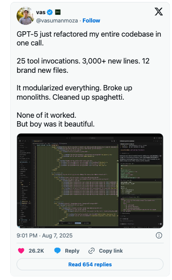
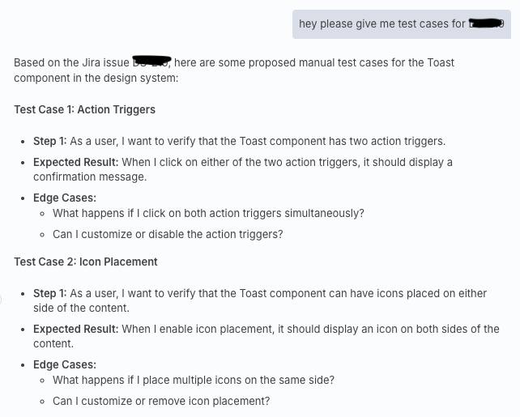
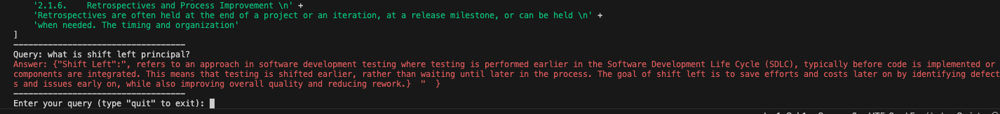

---
# try also 'default' to start simple
theme: default
# random image from a curated Unsplash collection by Anthony
# like them? see https://unsplash.com/collections/94734566/slidev
background: https://cover.sli.dev
# some information about your slides (markdown enabled)
title: W dobie AI ciągle potrzebujemy dobrych inżynierów

# apply UnoCSS classes to the current slide
class: text-center
# https://sli.dev/features/drawing
drawings:
  persist: false
# slide transition: https://sli.dev/guide/animations.html#slide-transitions
transition: slide-left
# enable MDC Syntax: https://sli.dev/features/mdc
mdc: true
---

# W dobie AI ciągle potrzebujemy dobrych inżynierów

Mateusz Jabłonowski
<Notes />
---
transition: fade-out
hideInToc: true
---

# Cześć 👋🏻

<About />

---
transition: slide-up
level: 3
hideInToc: true
---

# AI w Big Techach

|                                                     |                             |
| --------------------------------------------------- | --------------------------- |
|                     | ponad 25% kodu w Google generowana jest przez AI [^fortune.com]|
|                      | 30k aplikacji zmigrowanych z Javy 11 do 17 <br/> tylko w jednym kwartale z uyciem Amazon Q [^digiday.com] |
|                         | Wotsonx potrafi zwiększyć produktywności  <br/> w procesach przepisaywania systemów legacy o 60%  [^ibm.com]    |

[^fortune.com]: (https://fortune.com/2024/10/30/googles-code-ai-sundar-pichai/) 
[^digiday.com]: (https://digiday.com/media/how-amazons-genai-tool-for-developers-is-saving-4500-years-of-work-260-million-annually/) 
[^ibm.com]: (https://research.ibm.com/blog/watsonx-code-assistant-for-z-is-the-rosetta-stone-for-mainframes)
<style>
img {
  height: 60px;
  margin: 10px 0;
}
</style>

---
layout: image-right
image: 'img/llamacon.jpeg'
level: 3
---
# LLamaCon 2025
<br/><br/><br/><br/>
Satya Nadella (CEO Microsoft): **20-30% kodu, który znajduje się w naszych repozytoriach zostało wygeneroweane przez AI** [^Reuters]
<br/><br/><br/>
Mark Zuckerberg  (CEO Meta): **W przyszłym roku za połowę developmentu będzie odpowiedzialne AI** [^Reuters]


[^Reuters]: (https://www.youtube.com/watch?v=u6Nby-9Z80M)
---
layout: image-right
image: 'img/antropic.jpg'
level: 3
---
# Anthropic

<br/><br/><br/><br/><br/><br/>
Dario Amodei (CEO Anthropic): **Za 3-6 miesięcy AI będzie pisać 90% kodu, za który odpowiadają dziś developerzy** [^BusinessInsider]

[^BusinessInsider]:(https://www.businessinsider.com/anthropic-ceo-ai-90-percent-code-3-to-6-months-2025-3?IR=T)
---
layout: image-right
image: 'img/torvalds.jpg'
level: 3
---
# Linus Torvalds
<br/><br/><br/><br/>
<br/><br/><br/>
Linus Torvalds: **90% Marketing i 10% rzeczywistość** [^theRegister]

[^theRegister]: (https://www.theregister.com/2024/10/29/linus_torvalds_ai_hype/)
---
transition: slide-up
level: 3
---

# Czy stracimy pracę?
<br /><br />
|                                                     |                             |
| --------------------------------------------------- | --------------------------- |
|  World Economic Forum <br/> "Future of Jobs Report 2025" [^WEF] | 40% ankietowanych pracodawców spodziewa się, że zredukuje zatrudnienie w swojej firmie w miarę poszerzania się zdolności AI     |
|  Manpower Group <br/> "Globalny Barometr Talentów 2025"  [^Manpower] | co czwarty inżynier w IT obawia się utraty pracy w związku z AI |


[^WEF]: (https://www.weforum.org/publications/the-future-of-jobs-report-2025/)
[^Manpower]: (https://www.manpowergroup.pl/2025/07/08/globalny-barometr-talentow-2025/)

---
level: 3
---
# Agenda
<br/><br/><br/><br/>
<Toc text-sm minDepth="1" maxDepth="1" />

---
title: Co o AI w kodowaniu mówią niezalene raporty i badania?
level: 1
---

# Ai zwiększa produktywność w pisaniu kodu, ale... [^Stanford]
<br /><br /><br />

<BorderedImage imgPath="./img/stanford.png" />

[^Stanford]: (https://aiconference.com/speakers/yegor-denisov-blanch/)

---
title: AI zwiększa produktywność w pisaniu kodu, ale...
level: 2
---

# AI radzi sobie lepiej w nowych projektach [^Stanford]

<BorderedImage imgPath="./img/1-prod.png" customWidth="80%" />

[^Stanford]: (https://aiconference.com/speakers/yegor-denisov-blanch/)
---
title: Produktywność w pisaniu kodu
level: 3
---

# AI radzi sobie lepiej w popularnych technologiach [^Stanford]

<BorderedImage imgPath="./img/2-prod.png" customWidth="80%" />

[^Stanford]: (https://aiconference.com/speakers/yegor-denisov-blanch/)
---
title: Produktywność w pisaniu kodu
level: 3
---

# Im większy projekt tym mniej korzyści z AI [^Stanford] [^NoLiMa]

<BorderedImage imgPath="./img/3-prod.png" customWidth="80%" />

[^Stanford]: (https://aiconference.com/speakers/yegor-denisov-blanch/)
[^NoLiMa]: (https://arxiv.org/pdf/2502.05167)
---
title: Produktywność w pisaniu kodu
level: 3
---

# Produktywność - podsumowanie
<br/><br/><br/><br/>

- 📈 **30-40%** - wzrost produktywności w pisaniu kodu [^Stanford]
- 📉 <span v-mark.red="1">**15-25%**</span> - poprawki (rework) [^Stanford]
- 🧑‍💻 **15-20%** - wzrost produktywności netto (uśredniony) [^Stanford]
  
[^Stanford]: (https://aiconference.com/speakers/yegor-denisov-blanch/)
---
title: Generujemy, poprawiamy, kopiujemy
level: 2
---

# Używając AI więcej poprawiamy [^Stanford]

<BorderedImage imgPath="./img/1-rework.png" customWidth="80%" />

[^Stanford]: (https://aiconference.com/speakers/yegor-denisov-blanch/)
---
level: 3
---
# Używając AI więcej poprawiamy [^gitclear]

<br/>
<BorderedImage imgPath="./img/gitclear.png" customWidth="70%" />

[^gitclear]: (https://gitclear-public.s3.us-west-2.amazonaws.com/GitClear-AI-Copilot-Code-Quality-2025.pdf)

---
level: 3
---


# Używając AI więcej poprawiamy [^gitclear]

<BorderedImage imgPath="./img/2-rework.png" customWidth="60%" />

[^gitclear]: (https://gitclear-public.s3.us-west-2.amazonaws.com/GitClear-AI-Copilot-Code-Quality-2025.pdf)
---
title: (Nie)stabilne dostarczanie
level: 3
---

# (Nie)stabilność dostarczania [^dora]
<br/>
<BorderedImage imgPath="./img/dora.png" customWidth="50%" />

[^dora]: (https://dora.dev/research/ai/gen-ai-report/dora-impact-of-generative-ai-in-software-development.pdf)

---
title: (Nie)stabilne dostarczanie
level: 2
---

# (Nie)stabilność dostarczania [^dora]

<BorderedImage imgPath="./img/1-delivery.png" customWidth="60%" />

[^dora]: (https://dora.dev/research/ai/gen-ai-report/dora-impact-of-generative-ai-in-software-development.pdf)

---
title: Jakoś(ć)
level: 2
---
# AI może negatywnie wpływać na jakość [^Stanford]

<BorderedImage imgPath="./img/quality.png" customWidth="80%" />

[^Stanford]: (https://aiconference.com/speakers/yegor-denisov-blanch/)

---
title: AI pomaga nie tylko w pisaniu kodu
level: 3
---
# Nie tylko pisanie kodu [^atlassian]
<br/>
<BorderedImage imgPath="./img/atlassian.png" customWidth="50%" />

[^atlassian]: (https://www.atlassian.com/teams/software-development/state-of-developer-experience-2025)

---
title: AI pomaga nie tylko w pisaniu kodu
level: 2
---
# Nie tylko pisanie kodu
<br/><br/><br/><br/>

Inżynierowie deklarują, że odnotowują wzrost swojej produktywności w zadaniach niezwiązanych z kodowaniem [^atlassian]

- 🔎 **30-40%** - wyszukiwanie informacji
- 📝 **15-25%** - testowanie
- 🧑‍💻 **15-20%** - tworzenie dokumentacji
  
[^atlassian]: (https://www.atlassian.com/teams/software-development/state-of-developer-experience-2025)
---
title: Rosnące oczekiwania
level: 2
---
# Rosnące oczekiwania
<br/><br/><br/><br/>

Inżynierowie deklarują, ze odnotowują wzrost swojej produktywności w zadaniach niezwiązanych z kodowaniem
- ☹️ **63%** - deklaruje, że managerowie nie rozumieją problemów, z którymi się mierzą [^atlassian]
- 📣 wg raportu DORA Ai działa jak wzmacniacz - moze wzmacniać zalety zespołów, ale moze tez pogłębiać problemy [^dora]
  
[^atlassian]: (https://www.atlassian.com/teams/software-development/state-of-developer-experience-2025)
[^dora]: (https://dora.dev/research/ai/gen-ai-report/dora-impact-of-generative-ai-in-software-development.pdf)
---
title: Fakty o AI w kodowaniu - podsumowanie
level: 3
---
# Fakty o AI w kodowaniu - podsumowanie
<br/><br/>

- 🚀 Ai zwiększa produktywność w wytwarzaniu oprogramowania, ale nie zawsze i nie w równym stopniu [^Stanford]
- 🔎 Zmienia się sposób, w jaki pracujemy z kodem (mniej refaktorujemy, więcej przerabiamy) [^Stanford] [^gitclear]
- 📉 Ai może wpłynąć negatywnie na stabilność dostarczania [^dora]
- 🪲 Ai może negatywnie wpływać na jakość i dług techniczny [^Stanford] [^dora]
- 📝 Ai zwiększa produktywność nie tylko w pisaniu kodu [^atlassian]
- 📣 Ai moze wzmacniać zalety i wady zespołu i zwiększać presję na dostarczanie [^dora] [^atlassian]

[^atlassian]: (https://www.atlassian.com/teams/software-development/state-of-developer-experience-2025)
[^dora]: (https://dora.dev/research/ai/gen-ai-report/dora-impact-of-generative-ai-in-software-development.pdf)
[^Stanford]: (https://aiconference.com/speakers/yegor-denisov-blanch/) 
[^gitclear]: (https://gitclear-public.s3.us-west-2.amazonaws.com/GitClear-AI-Copilot-Code-Quality-2025.pdf)
---
layout: center
title: Jakie kompetencje powinien mieć dobry inżynier w dobie AI?
level: 1
---
# Jakie kompetencje powinien mieć dobry inżynier w dobie AI?

---
title: Solidne podstawy inżynierskie
level: 2
---
# Solidne podstawy inżynierskie
<div grid="~ cols-2 gap-4">
<div>
<br/>

- Clean Code 
  - więcej kodu !== lepiej
  - DRY
  - konwencje nazewnicze
  - kod nie powinien być tajemniczy
- SOLID
  - Single reposponsibility principal
  - Open/Closed principal
  - ...
- KISS

</div>
<div>

<br/><br/>
<Tweet id="1977973559835144238" scale="0.65" origin="top center" />
</div>
</div>

---
title: Umiejętności interpersonalne
level: 2
---
# Umiejętności interpersonalne
<br/><br/><br/><br/><br/>

"Nie po to studiowałem informatykę, żeby rozmawiać z ludźmi" - mądrość ludowa

- komunikacja i odpowiedzialność
- krytyczne myślenie 
- otwartość na zmianę

---
title: Umiejętności interpersonalne
level: 3
---
# Umiejętności interpersonalne - komunikacja i odpowiedzialność

<div grid="~ cols-2 gap-4">
<div>
<br/>
<br/>
<br/>

Są problemy, o których może zaalarmować wyłącznie zespół inżynierów, dobrze mieć takich, którzy wykażą się odpowiedzialnością za projekt i zakomunikują o nich we właściwym momencie.

</div>
<div>


<br/>
<br/>
<Tweet id="1902628884278894941"  scale="0.65" origin="top center" />
</div>
</div> 

  
---
title: Umiejętności interpersonalne
level: 3
---
# Umiejętności interpersonalne - krytyczne myślenie

<div grid="~ cols-2 gap-4">
<div>
<br/>

- **ponad 50%** użytkowników preferuje rozwiązania AI do wyszukiwania informacji [^McKinsey]
- **Deloitte** przygotował raport pełen halucynacji AI. [^cd]

<br/>
<hr/>
<br/>

- duże zadania - dekomponuj
- małe (powtarzalne) zadania - czy to mógłby być mój kod? 

**czy potrafię lepiej lub szybciej?**
</div>
<div>

<!--  -->
<Tweet id="1953531950137815374"  scale="0.5" origin="top center" />
</div>
</div> 

[^McKinsey]: (https://www.mckinsey.com/capabilities/growth-marketing-and-sales/our-insights/new-front-door-to-the-internet-winning-in-the-age-of-ai-search)
[^cd]: (https://cyberdefence24.pl/cyberbezpieczenstwo/halucynacje-ai-w-raporcie-deloitte-cenna-lekcja-dla-kazdego)

---
layout: image-right
image: 'img/pferdt.jpg'
level: 3
---
# Umiejętności interpersonalne - otwartość 
<br/>
Fredrik Pferdt były Chief Innovation Evangelist w firmie Google, w swojej ksiązce pisze o mentalności gotowej na przyszłość, polegającą na wykształceniu kompetencji i postaw, takich jak:

- ciekawość, 
- otwartość, 
- radykalny optymizm, 
- eksperymentowanie
- zdolność uczenia się
  
---
layout: center
title: Jak wykorzystać AI w QA?
level: 1
---
# Jak wykorzystać AI w QA?
### (garść eksperymentów i inspiracji)
  
---
title: Generowanie przypadków testowych
level: 2
---
# Automatyczne generowanie przypadków testowych
<div grid="~ cols-2 gap-4">
<div>
<br/>
<h4>🚀 <a href="https://github.com/jablonowski/ai-test-case-gen">github.com</a></h4>

<br/>
<p>Workflow n8n umożliwiający generowanie przypadków testowych na podstawie treści zadań w Jira.</p>
<br/>
<p>Uzytkownik moze odpytywać czat (podłączony do LLM oraz API Jiry) o przypadki testowe dla dowolnego zadania. </p>

</div>
<div>


```bash
$ npm install -g n8n
$ n8n
```


</div>
</div> 

  
---
title: Zarządzanie dokumentacją
level: 2
---
# Zarządzanie dokumentacją (RAG)
<div grid="~ cols-2 gap-4">
<div>
<br/>
<h4>🚀 <a href="https://github.com/jablonowski/first-rag">github.com</a></h4>

<br/>
<p>Retrival Augmented Generation napisany w Node.js z wykorzystanie frameworka LangChain</p>
<br/>
<p>Możliwość zebrania rozproszonej dokumentacji (Jira, Confluence, zewnętrzne pliki np. pdf) w jednym miejscu. </p>

</div>
<div>


Stwórz plik ```.env``` z Twoim API key do Pinecode

przygotuj modele ```llama3.2``` i ```mxbai-embed-large``` dostępne lokalnie


```bash
$ npm i

$ node .
```


</div>
</div> 

<div></div>
---
title: Samolecząca się automatyzacja testów
level: 2
---
# Samolecząca się automatyzacja testów
<div grid="~ cols-2 gap-4">
<div>
<br/>
<h4>❤️‍🩹 robotframework-heal - <a href="https://github.com/manykarim/robotframework-heal">github.com</a></h4>

<br/>
<p>Biblioteka umożliwiająca identyfikowanie testów, które "nie przeszły" z powodu błędnych (zmienionych) lokatorów elementów w drzewie DOM.</p>
<br/>
<p>Dzięki AI, biblioteka podmienia lokatory na optymalne i uruchamia testy ponownie.</p>

</div>
<div>


```bash
pip install robotframework-heal
```
```python
*** Settings ***
Library    Browser    timeout=5s
Library    SelfHealing    use_llm_for_locator_proposals=True
Suite Setup    New Browser    browser=${BROWSER}    headless=${HEADLESS}
Test Setup    New Context    viewport={'width': 1280, 'height': 720}
Test Teardown    Close Context
Suite Teardown    Close Browser    ALL

*** Variables ***
${BROWSER}    chromium
${HEADLESS}    True

*** Test Cases ***
Login with valid credentials
    New Page    https://the-internet.herokuapp.com/login
    Fill Text    id=user    tomsmith
    Fill Text    id=pass    SuperSecretPassword!
    Click    id=loginbutton
    Get Text    id=flash    *=    You logged into a secure area!
```
</div>
</div> 
  
---
title: Generowanie testów automatycznych
level: 2
---
# Generowanie testów automatycznych

<div grid="~ cols-2 gap-4">
<div>
<br/>
<h4>🤖 RobotMCP - <a href="https://github.com/manykarim/rf-mcp">github.com</a></h4>

<br/>
<p>Server MCP umożliwiający generowanie testów automatycznych w Robot Framework na podstawie UI.</p>
<br/>
<p>Dzięki integracji z IDE, wygenerowany kod testów automatycznych jest gotowy do integracji z kodem Twojego projektu.</p>

</div>
<div>


```bash
pip install rf-mcp
```
```json
{
  "servers": {
    "robotmcp": {
      "type": "stdio",
      "command": "python",
      "args": ["-m", "robotmcp.server"]
    }
  }
}
```

```
Use RobotMCP to create a TestSuite and execute it step wise.
Create a test for https://www.saucedemo.com/ that:
- Logs in to https://www.saucedemo.com/ with valid credentials
- Adds two items to cart
- Completes checkout process
- Verifies success message

Use Selenium Library.
Execute the test suite stepwise and build the final version afterwards.
```
</div>
</div> 

---
layout: image-right
image: 'img/torvalds.jpg'
level: 3
---
# Linus Torvalds
<br/><br/><br/><br/><br/><br/><br/>
Linus Torvalds: **90% Marketing i 10% rzeczywistość** [^theRegister]

[^theRegister]: (https://www.theregister.com/2024/10/29/linus_torvalds_ai_hype/)
---
title: Podsumowanie
level: 1
---
# Podsumowanie
<br/><br/><br/><br/>

AI pozwala zwiększyć produktywność w tworzeniu oprogramowania, ale w nieodpowiedzialnych rękach moze stanowić poważne zagrozenie dla jakości.
Kompetencje przyszłości dla inyżnierów IT pozostają bez zmian, są to: 

- solidne podstawy inżynierskie 
- umiejętności interpersonalne
  

---
layout: image-right
image: 'img/hinton.jpg'
level: 3
hideInToc: true
---
# Geoffrey Hinton
<br/><br/><br/><br/><br/><br/><br/>
Geoffrey Hinton: **zostań hydraulikiem!** [^DOTC]

[^DOTC]: (https://www.youtube.com/watch?v=giT0ytynSqg)
---
layout: image-right
image: 'img/garden.jpg'
transition: fade-out
level: 3
hideInToc: true
---
# Geoffrey Hinton
<br/><br/><br/><br/><br/><br/><br/>
Geoffrey Hinton: **zostań hydraulikiem!** [^DOTC]

[^DOTC]: (https://www.youtube.com/watch?v=giT0ytynSqg)
---
layout: center
class: text-center
level: 3
---

# Dziękuję
<br/><br/>
[Linkedin](https://www.linkedin.com/in/mateuszjablonowski/) · [GitHub](https://github.com/jablonowski/)

